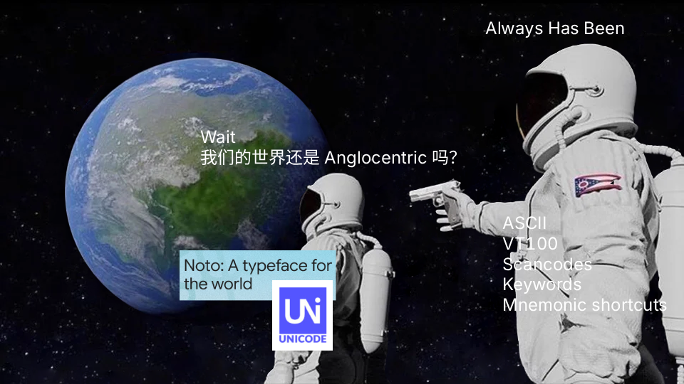

# Ksfour

---

## hi

i live on my computer, but these are the only things i take seriously:

- commissioning: managing ideas, characters, and artists via obsidian w/ kanban
- life logging: coffee notes & life reflections

## github

i stopped learning new concepts and i already don't know what coding is

get tired of ssg and other things i never understood so i deleted most of my repos

writing mostly in simplified chinese doesn't mean it's meaningless. it's llm era now if anyone really needs to read my writings just ask ai

## meta

[skill issue](/content/2025-12-18%20skill-issue.md) (en_US), [why i started this blog](/content/2025-08-30%20so-i-started-this-blog.md) (zh_CN), [why not choose freedom](/content/2025-09-05%20pursuing-freedom.md) (zh_CN), [opinion for vibe coding](/content/2025-12-24%20vibe-coding.md)

## software

stopped using these not for persuasive reasons, but for reasons that tangibly affect me

[linux](/content/2025-12-17%20linux.md) (en_US), [emacs](/content/2025-12-21%20emacs.md) (en_US), [softwares make me boring](/content/2026-01-12%20boring.md) (zh_CN)

uses this (uses this concept: <https://usesthis.com/>):

obsidian ([switching to emacs](/content/2025-12-21%20emacs.md#2025-10-31T16:41:22), [back from emacs](/content/2025-12-22%20obsidian.md#2025-12-22T01:54:00)), keymap ([zh_CN](/content/2025-12-26%20keymap.md), [en_US](/content/2025-12-30%20keymap-en.md))
